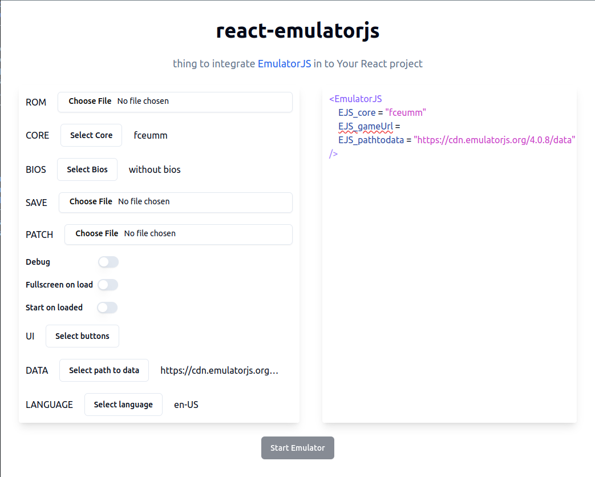

# React-emulatorjs playground

Playground example for testing `react-emulatorjs` library

<div align = center>

[![Button Playground]][Playground]
[![Button NPM]][NPM]
[![Button Gihub]][Github]
[![Button API]][API]

</div>



## How to start

Install dependencies

```
npm install
```

Start dev server

```
npm run dev
```

<!-- Quick links --->

[Playground]: https://dimitrikarpov.github.io/react-emulatorjs
[NPM]: https://www.npmjs.com/package/react-emulatorjs
[Github]: https://github.com/dimitrikarpov/react-emulatorjs
[API]: https://tsdocs.dev/docs/react-emulatorjs/2.1.0/types/Settings.html

<!-- Badges --->

[Button Playground]: https://img.shields.io/badge/demo-playground?style=for-the-badge&logo=githubpages&labelColor=%23C21292&color=%239195F6
[Button NPM]: https://img.shields.io/badge/npm-reactemulatorjs?style=for-the-badge&logo=npm&color=%239195F6&labelColor=FF6969
[Button Gihub]: https://img.shields.io/badge/github-777?style=for-the-badge&logo=github&labelColor=%2300A9FF&color=%23D0A2F7
[Button API]: https://img.shields.io/badge/api-api?style=for-the-badge&logo=docsdotrs&labelColor=blue&color=%239195F6
